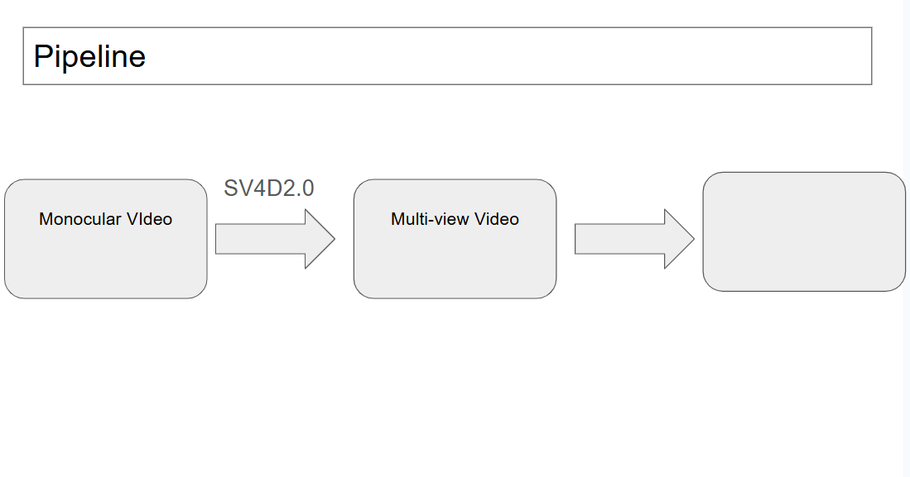

# 視覺資產總表 — 方法說明 + Poster 用圖(2026-06-12)

> 所有可用的 visualization / animation,按「故事弧的哪一幕」分組。
> 來源:`meetTW_checkpoint_0601/figs/`(主要)、`docs/design/`、`docs/reports/assets_2026-05-31_lego_v2/`。
> 評等沿用 figs/INDEX.md:✅ 可直接上 poster · 🟡 需脈絡/改進。

---

## 第 1 幕 · Setting / Pipeline 概念圖

| 圖 | 說明 | 狀態 |
|---|---|---|
| `meetTW_checkpoint_0601/slide1_flow.drawio` | 高層 pipeline:單目影片 → SV4D → 57-view 多視角 → 我們的方法 → 4D | ⚠️ **尚未匯出 PNG**(機器無 drawio CLI,要去 app.diagrams.net 手動匯出) |
| `meetTW_checkpoint_0601/slide2_architecture.drawio` | 完整架構(leak-free,Stage A–E + motion-gated smart-photo) | ⚠️ 同上 |

舊版 block diagram(可暫代):

---

## 第 2 幕 · 方法(Stage A–E,逐階段視覺化)

### Stage A — 凍結 canonical(乾淨靜態 3DGS)

### Stage B — Motion mask(時間變異 + Otsu)

紅色 = 偵測為「在動」的像素:

時間變異 heatmap(亮 = 手臂區):

### Stage C — Part assignment(多視角投票)

每顆高斯分到 arm(紅)/ body(藍),5 視角:

旋轉動畫版 ✅:

### Stage D — Arm trajectory(DLT 三角化 init)

🟡 3D plot 偏小、放大才能上 poster;appendix 可直接用:

---

## 第 2 幕續 · 重建結果(+8.6 dB 的證據)

### 主 qualitative:3 欄 gallery(SV4D | clean d-3dgs | ours)

### Head-to-head:vanilla SC-GS(幾何爆炸)vs 我們(乾淨)

| Vanilla(11.43 dB) | Ours(20.35 dB) |
|---|---|
|  |  |

靜態 keyframe 版(slide/poster 印刷用):

| Vanilla t=10 | Ours t=10 |
|---|---|
|  |  |

多幀 contact sheet:

---

## 第 3 幕 · 轉折 — 「fuzz 不是 bug」

- 證據:input-pose view 渲染乾淨(digger 區 21.12 dB),fuzz 只出現在 VGM 不一致處。
- 圖:用上方 `vanilla_v0_t10.png` vs `ours_v0_t10.png` 對照 + 下面 canonical-only cone。

凍結 canonical 本身就能看到 cone(J3):

lego_v3 full-57 vs elev=0(canonical–view alignment 發現):

hellwarrior 同比較 🟡(兩者都糊 → 要搭配 pose-misalignment 解釋):

---

## 第 4 幕 · 診斷 — 可靠錐(最強資產)

### ★ HERO 圖 — 一張講完整個診斷故事(poster Slide 6 headline)

azimuth 可靠錐(空間+時間疊加)+ 空間 dB bars + elevation 退化:

### 細節支撐圖

D5+D6:azimuth polar PSNR、elevation −0.77 dB/10°、pose drift px:

D3 時間 flicker(37.5% 靜止像素假動;input 5.7% → 偏軸 57%):

D2/D7 定位(邊緣 1.4×;81% 外觀錯 / 19% 無中生有 / 0% 漏掉):

Generality:rigid → 空間崩、articulated → 時間 flicker(9.2×):

---

## 第 5 幕 · Fit-residual probe(GT-free 儀器,novel 貢獻)

probe 概念 + 結果:

cone 重現(GT-free):

跨場景 generality(lego ρ=0.82、hellwarrior ρ=0.87):

per-pixel 定位圖(lego_v3):

---

## Appendix / sanity

| 圖 | 說明 |
|---|---|
|  | held-out view ablation |
|  | held-out time ablation |

---

## 尚無圖、但故事需要的(缺口)

1. **slide1/slide2 drawio → PNG**:唯一剩的手動步驟(app.diagrams.net 匯出 2×)。
2. **Ablation 表的圖版**(deck Slide 3):目前只有表格,可選做 bar chart(+8.6 dB / 18× 參數)。
3. **SED 幾何診斷圖**:`runs_aux/sed_*.npz`(含 selfgen jumpingjacks/lego/standup)只有 npz,**還沒畫圖** —— 第 5 幕「三儀器三角驗證」需要一張 SED 對照圖。
4. **FV4D 數字圖**:`runs_aux/fv4d_{lego_v3,hellwarrior}.npz` 同樣只有 npz(471/873 遮底板數字)。
5. **fit-residual 時間軸**(optional):目前 probe 只有空間 cone;per-frame-Δ 殘差圖能補時間軸。
6. **三儀器對照表**(reference-based cone / fit-residual / SED)— poster ⑥ 需要,目前散在文件裡。
