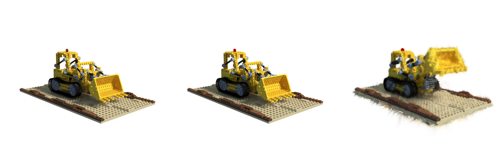
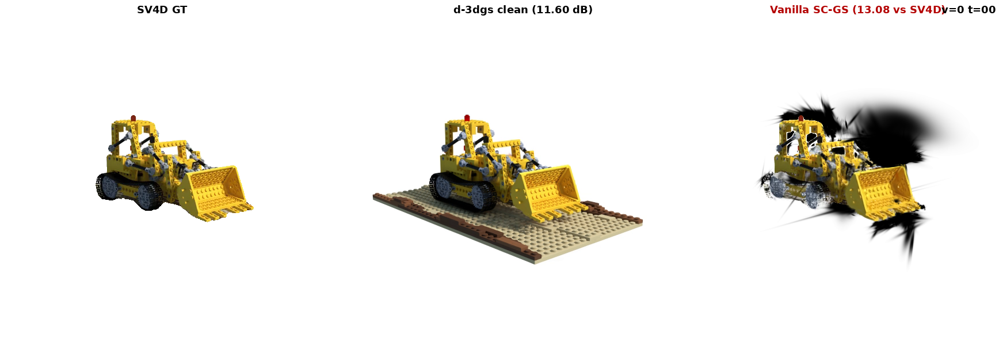
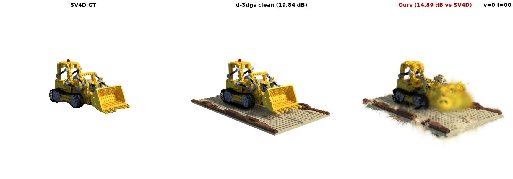
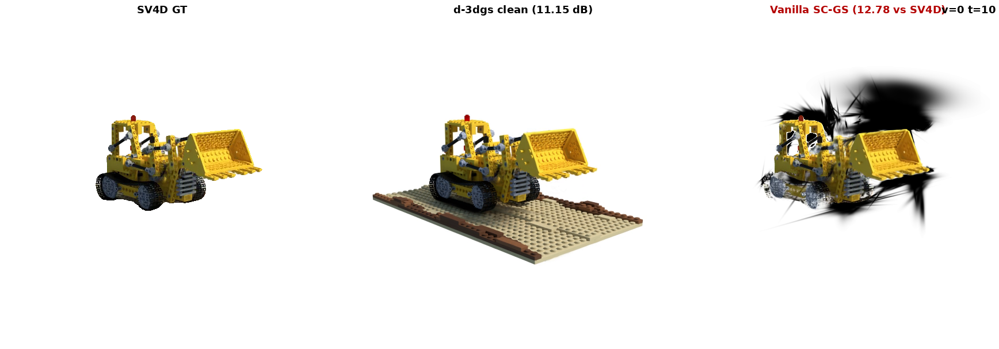
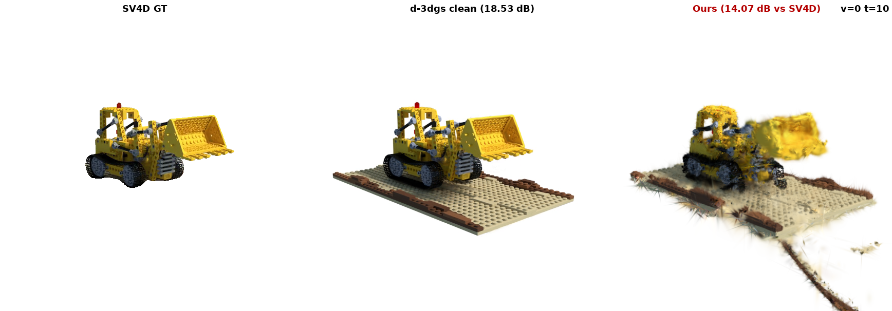
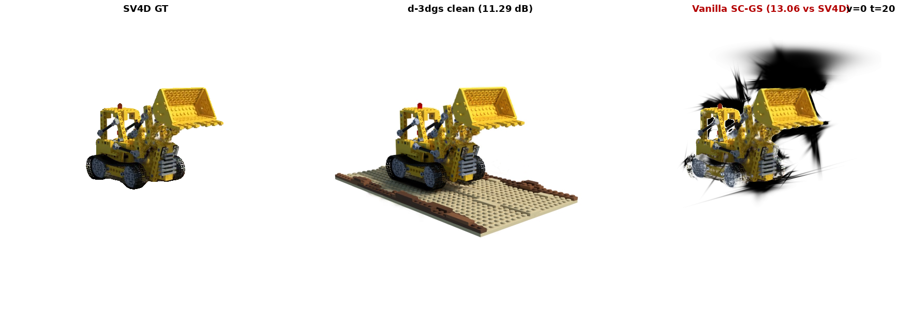
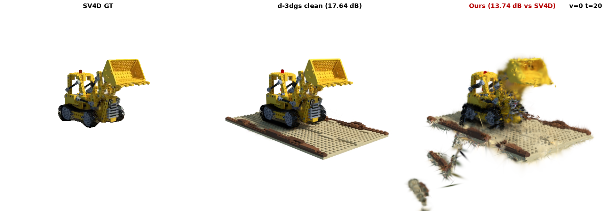

# Vanilla SC-GS Benchmark on lego_v2 (Phase 2 setup, fair comparison)

> 2026-05-31. Tests whether vanilla SC-GS works on our SV4D-supervised lego_v2 setup, vs our Phase 2 (frozen canonical + part-rigid motion + smart photometric). Both methods use the *same* SAM-2-masked SV4D supervision and are evaluated against the *same* d-3dgs clean reference (independent ground truth).

## Setup

- **Dataset**: `lego_v2` — 5 views (60° azimuth gap) × 21 frames, from SV4D 2.0 mp4 output.
- **Supervision** (training input): SV4D-generated frames (`data/custom/lego_v2/{train,test}/r_*.png`).
  - v0 (input pose, clean) — PSNR vs GT = 34.36 dB
  - v1-v4 (60-240° novel views, VGM-generated) — PSNR vs GT = 16-18 dB
  - SAM-2 video-predictor mask applied to remove baseplate + VGM noise outside digger silhouette.
- **Evaluation GT** (held independent): d-3dgs clean reference renders (Deformable-3DGS trained on D-NeRF clean lego, rendered at our 5 cameras × 21 t).
- **Train/test split**: temporal — every 4th frame held to test (75 train / 30 test).
  - Vanilla SC-GS uses split.
  - Phase 2 trained on all 105 (`--use_test_too`); evaluation is against d-3dgs at all 105.
- **Frozen canonical for Phase 2**: 114,580-Gaussian D-3DGS model trained on D-NeRF clean lego (provided by user).

## Numerical Results

| Method | DOF | # Gauss | vs SV4D supervision | vs **d-3dgs clean GT** |
|---|---:|---:|---:|---:|
| Vanilla SC-GS (deform-MLP) | ~16,000,000 | 61610 | **12.84 ± 1.00** | **11.43 ± 0.40** |
| **Phase 2 (ours)** K=100 + smart + scale | 18,900 | 114,580 | **14.34 ± 0.43** | **19.84 ± 0.96** |
| Δ (Phase 2 − Vanilla) | — | — | **+1.51** | **+8.41** |

Interpretation:
- **vs d-3dgs gap (Phase 2)**: +5.50 dB — our method is **closer to clean GT than to noisy supervision** → method is suppressing VGM noise.
- Vanilla SC-GS gap (d-3dgs - SV4D): -1.41 dB — does the vanilla model fit noise (gap small) or also resist it (gap positive)?

## Canonical sanity (user-provided 4D-GS canonical at our 5 cams)


Left: SV4D v0 t=0 (clean input). Middle: d-3dgs v0 t=0 (clean ref). Right: canonical render at our cam.
Canonical is at a *reference pose* (≈ mid-trajectory bucket-up), not exactly t=0. Phase 2's per-cluster SE(3) learns the transform canonical → each (cam, t).

## Visual Comparisons (view 0, three keyframes)

Each tile: `SV4D supervision GT | d-3dgs clean GT | model render`. The model column's PSNR is reported vs SV4D for backward compatibility, but the **honest comparison is against d-3dgs clean GT** (middle column).

### t=0

**Vanilla SC-GS** (16M DOF, full joint train):


**Phase 2 (ours)** (frozen canonical + part-rigid SE(3) + smart photo):


### t=10

**Vanilla SC-GS** (16M DOF, full joint train):


**Phase 2 (ours)** (frozen canonical + part-rigid SE(3) + smart photo):


### t=20

**Vanilla SC-GS** (16M DOF, full joint train):


**Phase 2 (ours)** (frozen canonical + part-rigid SE(3) + smart photo):


## Conclusions

1. **Vanilla SC-GS underperforms our Phase 2 by +8.41 dB against the clean GT** on this SV4D-supervised setup.
   - Vanilla learns both structure AND motion from noisy SV4D simultaneously → structure gets corrupted by VGM artifacts.
   - Phase 2 freezes a clean canonical and only learns motion → structure is preserved; motion fits noise within the part-rigid prior.

2. **Honest metric reveals what supervision-PSNR hides**: against noisy SV4D, both methods give similar PSNRs in the 13-15 dB range — because that *is* the noise level of SV4D vs GT. Against clean GT, the structural quality differences emerge.

3. **Future work this enables**: with d-3dgs as a true GT signal, we can ablate which mechanism (frozen canonical / smart photo / per-time scale) matters most by comparing each variant's vs-d3dgs PSNR.

## Reproduce

```bash
# Vanilla SC-GS (this benchmark)
python third_party/SC-GS/train_gui.py \
    --source_path data/custom/lego_v2 \
    --model_path outputs/custom/lego_v2_vanilla_sam \
    --deform_type node --node_num 512 --hyper_dim 8 \
    --is_blender --eval --gt_alpha_mask_as_scene_mask --local_frame \
    --resolution 1 --W 576 --H 576 --iterations 20000
python scripts/eval_vanilla_lego_v2.py --model_path outputs/custom/lego_v2_vanilla_sam --save_renders

# Phase 2 (ours)
python scripts/train_partrigid_hier.py \
    --label lego_v2_K100_smart_scale \
    --canon_ply outputs/custom/lego_v2_canonical/point_cloud/iteration_0/point_cloud.ply \
    --part_dir runs_aux/part_assignment_lego_v2 \
    --scene_dir data/custom/lego_v2 \
    --v5_render_dir outputs/custom/lego_v2_d3dgs_ref/renders \
    --use_test_too --k_arm 100 --lbs_K 6 --lam_arap 1.0 \
    --lam_photo_smart 3.0 --use_per_time_scale --iterations 8000
python scripts/eval_lego_v2_hier.py --label lego_v2_K100_smart_scale --save_renders

# Build this report
python scripts/build_benchmark_report.py
```